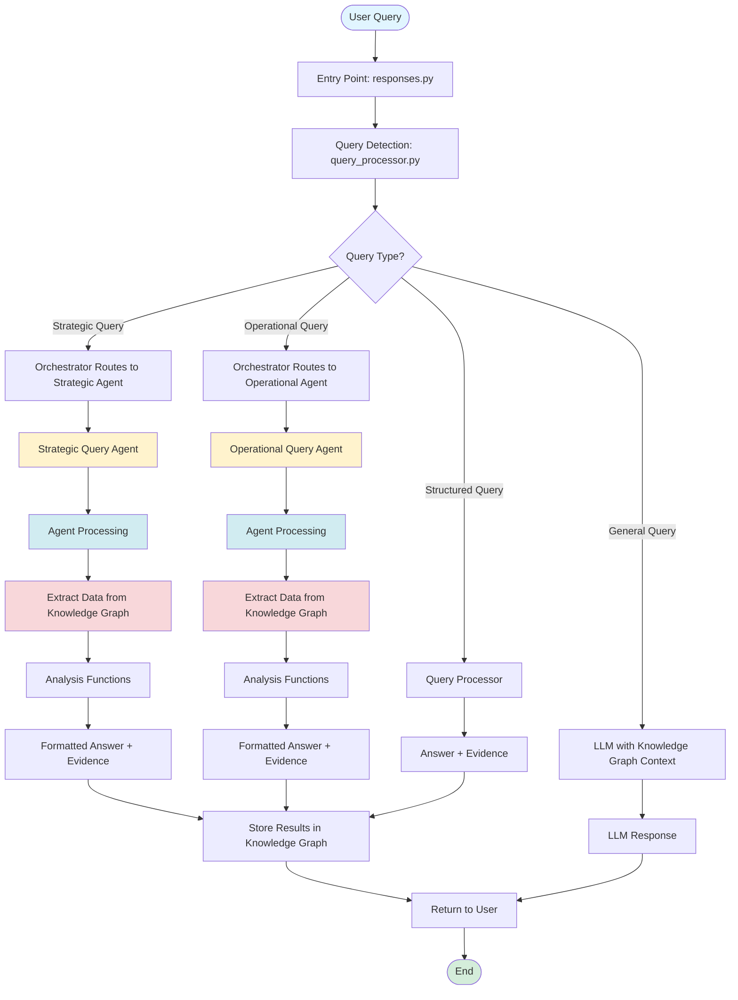

# Query Routing Flow: Strategic & Operational Queries

## Overview

This document explains how queries are detected, routed, and processed through the multi-agent system, specifically focusing on **Strategic** and **Operational** queries.

---

## Simple Architecture Diagram

```
                    ┌─────────────┐
                    │ User Query │
                    └──────┬──────┘
                           │
                           ▼
              ┌────────────────────────┐
              │  Entry: responses.py   │
              │  (Uses LLM for format) │
              └──────┬─────────────────┘
                     │
                     ▼
              ┌────────────────────────┐
              │  Query Detection       │
              │  (query_processor.py)  │
              └──────┬─────────────────┘
                     │
                     ▼
         ┌───────────────────────┐
         │    Orchestrator       │
         │  Routes to Agents      │
         └───────┬───────────────┘
                 │
    ┌────────────┼────────────┬────────────┬────────────┐
    │            │            │            │            │
    ▼            ▼            ▼            ▼            ▼
┌──────────┐ ┌──────────┐ ┌──────────┐ ┌──────────┐ ┌──────────┐
│Strategic │ │Operational│ │Statistics│ │Knowledge │ │Visualiz. │
│  Query   │ │  Query    │ │  Agent   │ │  Graph   │ │  Agent   │
│  Agent   │ │  Agent    │ │          │ │  Agent   │ │          │
└────┬─────┘ └────┬──────┘ └────┬─────┘ └────┬─────┘ └────┬─────┘
     │            │              │            │            │
     │            │              │            │            │
     │            │              │            │            │
     └────────────┼──────────────┼────────────┼────────────┘
                  │              │            │
                  │              │            │
                  │              │            │
                  └──────────────┼────────────┘
                                 │
                                 ▼
              ┌───────────────────────┐
              │  Knowledge Graph     │
              │  (Central Storage)    │
              │  • All agents access  │
              │    KG directly        │
              │  • KG Agent processes │
              │    documents          │
              └───────────┬──────────┘
                          │
                          │ (Results return to responses.py)
                          │
                          ▼
              ┌────────────────────────┐
              │  responses.py         │
              │  Formats with LLM      │
              │  (Ollama/OpenAI)      │
              └───────────┬────────────┘
                          │
                          ▼
                 ┌──────────────┐
                 │   Response   │
                 │  to User     │
                 └──────────────┘
```

---

## Flowchart: Agent Architecture & Query Processing Flow

### Mermaid Flowchart (for Markdown viewers that support it)



### Simplified Architecture Flowchart

```
┌─────────────────────────────────────────────────────────────────────────┐
│                         USER QUERY                                      │
│              (via Chat Interface)                                       │
└────────────────────────────┬────────────────────────────────────────────┘
                             │
                             ▼
┌─────────────────────────────────────────────────────────────────────────┐
│  Entry Point: responses.py                                              │
│  • Receives user query                                                  │
│  • Initiates query processing                                           │
└────────────────────────────┬────────────────────────────────────────────┘
                             │
                             ▼
┌─────────────────────────────────────────────────────────────────────────┐
│  Query Detection: query_processor.py                                    │
│  • Analyzes query to determine type                                      │
│  • Classifies as: Strategic | Operational | Structured | General        │
└────────────────────────────┬────────────────────────────────────────────┘
                             │
                    ┌────────┴────────┐
                    │                 │
        ┌───────────▼──────────┐      │
        │  Query Type?          │      │
        └───────────┬──────────┘      │
                    │                 │
        ┌───────────┴──────────┐      │
        │                      │      │
        ▼                      ▼      ▼
┌───────────────┐    ┌──────────────────────────────┐
│ Strategic     │    │ Other Query Types            │
│ Query         │    │ (Structured/General)          │
└───────┬───────┘    └──────────────┬───────────────┘
        │                          │
        ▼                          │
┌─────────────────────────────────────────────────────────────────────────┐
│  Orchestrator: orchestrator.py                                          │
│  • Routes queries to appropriate specialized agents                     │
│  • Manages agent coordination                                           │
└────────────────────────────┬────────────────────────────────────────────┘
                             │
        ┌────────────────────┼────────────────────┐
        │                    │                    │
        ▼                    ▼                    ▼
┌───────────────┐  ┌───────────────┐  ┌───────────────┐
│ Strategic     │  │ Operational   │  │ Query         │
│ Query Agent   │  │ Query Agent   │  │ Processor /   │
│               │  │               │  │ LLM           │
└───────┬───────┘  └───────┬───────┘  └───────┬───────┘
        │                  │                   │
        ▼                  ▼                   │
┌─────────────────────────────────────────────────────────────────────────┐
│  Agent Processing (Strategic & Operational Agents)                      │
│  ┌───────────────────────────────────────────────────────────────────┐  │
│  │ 1. Extract data from Knowledge Graph                              │  │
│  │    └─→ Reconstruct DataFrame from facts stored in KG             │  │
│  │                                                                   │  │
│  │ 2. Normalize and prepare data                                     │  │
│  │    └─→ Handle column name variations                              │  │
│  │                                                                   │  │
│  │ 3. Execute specialized analysis                                    │  │
│  │    └─→ Strategic: High-level insights & risk analysis            │  │
│  │    └─→ Operational: Department/team-level monitoring             │  │
│  └───────────────────────────────────────────────────────────────────┘  │
└────────────────────────────┬────────────────────────────────────────────┘
                             │
                             ▼
┌─────────────────────────────────────────────────────────────────────────┐
│  Analysis & Results                                                     │
│  • Perform data analysis (pandas operations)                             │
│  • Generate formatted answer with evidence                              │
│  • Store insights back in Knowledge Graph                               │
└────────────────────────────┬────────────────────────────────────────────┘
                             │
                             ▼
┌─────────────────────────────────────────────────────────────────────────┐
│                         USER RECEIVES ANSWER                             │
│  • Formatted response with evidence                                     │
│  • Insights stored for future reference                                 │
└─────────────────────────────────────────────────────────────────────────┘
```

---

## 1. Entry Point: User Query via LLM

**File:** `responses.py` → `respond()` function

When a user asks a question through the chat interface:

```python
# responses.py:613
def respond(message, history=None, system_message=...):
    # Step 1: Detect query type
    query_info = detect_query_type(message)  # From query_processor.py
```

---

## 2. Query Detection

**Files:**
- `query_processor.py` → `detect_query_type()`
- `strategic_queries.py` → `detect_strategic_query()`

### Detection Flow:

```
User Query
    ↓
detect_query_type() in query_processor.py
    ↓
    ├─→ First checks: detect_strategic_query() in strategic_queries.py
    │   ├─→ S1 patterns (Performance-Engagement-Status)
    │   ├─→ S2 patterns (Recruitment-Performance-Retention)
    │   ├─→ O1 patterns (Performance × Department)
    │   ├─→ O2 patterns (Absences × EmploymentStatus)
    │   ├─→ O3 patterns (Engagement × Manager)
    │   └─→ O4 patterns (Average per Group with Min/Max) ← NEW
    │
    └─→ If not strategic, checks:
        ├─→ Max/Min queries (structured)
        ├─→ Filter queries (structured)
        └─→ General queries (LLM)
```

### Query Types Returned:

**Strategic Queries:**
```python
{
    "query_type": "strategic",
    "strategic_type": "S1" | "S2" | "O1" | "O2" | "O3" | "O4",
    "subtype": "S1.1" | "O1.1" | "O4.1", etc.,
    "variables": ["PerformanceScore", "Department"],
    "operation": "monitor" | "track" | "compare" | "average_min" | "average_max",
    "metric": "PerformanceScore" | "Absences" | ... (for O4),
    "group_by": "ManagerName" | "Department" | ... (for O4),
    "aggregate_op": "min" | "max" (for O4)
}
```

---

## 3. Routing via Orchestrator

**File:** `orchestrator.py` → `orchestrate_query()`

### Routing Logic:

```python
# orchestrator.py:136-181
if query_info.get("query_type") == "strategic":
    strategic_type = query_info.get("strategic_type")
    
    # Route S1, S2 → Strategic Query Agent
    if strategic_type in ["S1", "S2"]:
        from strategic_query_agent import process_strategic_query_with_agent
        answer, evidence_facts, routing_info = process_strategic_query_with_agent(query_info, query)
    
    # Route O1, O2, O3, O4 → Operational Query Agent
    elif strategic_type in ["O1", "O2", "O3", "O4"]:  # O4 added
        from operational_query_agent import process_operational_query_with_agent
        answer, evidence_facts, routing_info = process_operational_query_with_agent(query_info, query)
```

---

## 4. Processing: Strategic Query Agent

**File:** `strategic_query_agent.py` → `process_strategic_query_with_agent()`

### What it does:

1. **Reconstructs DataFrame** from Knowledge Graph (`reconstruct_dataframe_from_facts()`)
2. **Normalizes column names** (handles variations like "PerformanceScore" vs "PerfScoreID")
3. **Routes to specific analysis functions** in `strategic_queries.py`:
   - `_analyze_s1_1()` - Early-warning risk clusters
   - `_analyze_s1_2()` - Active high performers at risk
   - `_analyze_s2_1()` - Strategic ranking of recruitment channels
   - `_analyze_s2_2()` - Underperforming recruitment sources

### Result:
- Returns formatted markdown answer
- Returns evidence facts for traceability
- Stores insights in knowledge graph for LLM access

---

## 5. Processing: Operational Query Agent

**File:** `operational_query_agent.py` → `process_operational_query_with_agent()`

### What it does:

1. **Reconstructs DataFrame** from Knowledge Graph (uses shared function from `strategic_query_agent.py`)
2. **Normalizes column names** (handles variations)
3. **Routes to specific analysis functions** in `strategic_queries.py`:
   - `process_o1_1()` - Departmental performance monitoring
   - `process_o1_2()` - Tracking low-performance concentrations
   - `process_o2_1()` - Absence patterns by employment status
   - `process_o3_1()` - Team-level engagement monitoring
   - `process_o4_1()` - Average per group with min/max ← NEW

### Result:
- Returns formatted markdown answer with tables
- Returns evidence facts for traceability
- Stores insights in knowledge graph for LLM access

---

## 6. Analysis Functions

**File:** `strategic_queries.py`

### Strategic Functions (S1, S2):
- `_analyze_s1_1()` - Multi-variable clustering analysis
- `_analyze_s1_2()` - Risk detection analysis
- `_analyze_s2_1()` - Recruitment channel ranking
- `_analyze_s2_2()` - Underperformer identification

### Operational Functions (O1, O2, O3, O4):
- `process_o1_1()` - Departmental performance monitoring
- `process_o1_2()` - Low-performance tracking
- `process_o2_1()` - Absence pattern analysis
- `process_o3_1()` - Team engagement monitoring
- `process_o4_1()` - Average per group with min/max ← NEW

**All functions:**
- Take DataFrame and column mappings as input
- Perform pandas groupby/aggregation operations
- Return formatted markdown answer + evidence facts

---

## Complete Flow Diagram

```
┌─────────────────────────────────────────────────────────────┐
│ User asks question via LLM chat interface                   │
└──────────────────────┬──────────────────────────────────────┘
                       │
                       ▼
┌─────────────────────────────────────────────────────────────┐
│ responses.py: respond()                                      │
│   - Entry point for all queries                            │
└──────────────────────┬──────────────────────────────────────┘
                       │
                       ▼
┌─────────────────────────────────────────────────────────────┐
│ query_processor.py: detect_query_type()                     │
│   ├─→ Calls strategic_queries.py: detect_strategic_query() │
│   │   ├─→ Checks S1, S2, O1, O2, O3, O4 patterns           │
│   │   └─→ Returns query_info with strategic_type            │
│   └─→ If not strategic, checks structured/general queries  │
└──────────────────────┬──────────────────────────────────────┘
                       │
                       ▼
┌─────────────────────────────────────────────────────────────┐
│ responses.py: respond()                                      │
│   if query_info["query_type"] == "strategic":               │
│       orchestrate_query(message, query_info)               │
└──────────────────────┬──────────────────────────────────────┘
                       │
                       ▼
┌─────────────────────────────────────────────────────────────┐
│ orchestrator.py: orchestrate_query()                        │
│   if strategic_type in ["S1", "S2"]:                        │
│       └─→ strategic_query_agent.py:                         │
│           process_strategic_query_with_agent()              │
│                                                              │
│   elif strategic_type in ["O1", "O2", "O3", "O4"]:          │
│       └─→ operational_query_agent.py:                       │
│           process_operational_query_with_agent()            │
└──────────────────────┬──────────────────────────────────────┘
                       │
        ┌──────────────┴──────────────┐
        │                             │
        ▼                             ▼
┌──────────────────┐        ┌──────────────────┐
│ Strategic Agent  │        │ Operational Agent│
│                  │        │                  │
│ 1. Reconstruct   │        │ 1. Reconstruct   │
│    DataFrame     │        │    DataFrame     │
│    from KG       │        │    from KG       │
│                  │        │                  │
│ 2. Normalize     │        │ 2. Normalize    │
│    columns       │        │    columns       │
│                  │        │                  │
│ 3. Route to:     │        │ 3. Route to:    │
│    - _analyze_    │        │    - process_   │
│      s1_1()      │        │      o1_1()     │
│    - _analyze_    │        │    - process_   │
│      s1_2()      │        │      o1_2()     │
│    - _analyze_    │        │    - process_   │
│      s2_1()      │        │      o2_1()     │
│    - _analyze_    │        │    - process_   │
│      s2_2()      │        │      o3_1()    │
│                  │        │    - process_   │
│                  │        │      o4_1()    │
└────────┬─────────┘        └────────┬─────────┘
         │                           │
         └───────────┬───────────────┘
                     │
                     ▼
┌─────────────────────────────────────────────────────────────┐
│ strategic_queries.py                                         │
│   - All analysis functions (S1.1, S1.2, S2.1, S2.2,        │
│     O1.1, O1.2, O2.1, O3.1, O4.1)                          │
│   - Perform pandas operations (groupby, aggregation)         │
│   - Return: (answer_parts, evidence_facts)                  │
└──────────────────────┬──────────────────────────────────────┘
                       │
                       ▼
┌─────────────────────────────────────────────────────────────┐
│ Results returned to orchestrator → responses.py → User      │
│   - Formatted markdown answer                                │
│   - Evidence facts for traceability                          │
│   - Stored in knowledge graph for LLM access                │
└─────────────────────────────────────────────────────────────┘
```

---

## Key Files Summary

| File | Purpose | Key Functions |
|------|---------|---------------|
| `responses.py` | Entry point for all queries | `respond()` |
| `query_processor.py` | Query type detection | `detect_query_type()` |
| `strategic_queries.py` | Strategic query detection + all analysis functions | `detect_strategic_query()`, `process_o1_1()`, `process_o4_1()`, etc. |
| `orchestrator.py` | Routes queries to appropriate agents | `orchestrate_query()`, `find_agents_for_query()` |
| `strategic_query_agent.py` | Processes S1, S2 queries | `process_strategic_query_with_agent()`, `reconstruct_dataframe_from_facts()` |
| `operational_query_agent.py` | Processes O1, O2, O3, O4 queries | `process_operational_query_with_agent()` |
| `knowledge.py` | Knowledge graph storage | `graph`, `add_to_graph()`, `retrieve_context()` |

---

## Example: "Average performance score per manager and bring me the min"

1. **User asks:** "get the average performance score per manager and bring me the min"
2. **Detection:** `detect_strategic_query()` matches O4 pattern
   - Returns: `{"query_type": "strategic", "strategic_type": "O4", "metric": "PerformanceScore", "group_by": "ManagerName", "aggregate_op": "min"}`
3. **Routing:** `orchestrate_query()` routes to Operational Query Agent
4. **Processing:** `process_operational_query_with_agent()`:
   - Reconstructs DataFrame from KG
   - Normalizes columns
   - Calls `process_o4_1(df, columns, query_info)`
5. **Analysis:** `process_o4_1()`:
   - Groups by ManagerName
   - Calculates average PerformanceScore per manager
   - Finds minimum average
   - Returns formatted table
6. **Result:** Returns to user with evidence

---

## Data Flow

1. **CSV Upload** → Workers extract facts → Knowledge Graph
2. **Query** → Reconstruct DataFrame from KG → Analysis → Results
3. **Results** → Stored in KG → LLM can access later

---

## Key Design Decisions

1. **DataFrame Reconstruction:** Both agents reconstruct DataFrame from KG (no need for original CSV)
2. **Shared Functions:** `reconstruct_dataframe_from_facts()` and `normalize_column_name()` are shared
3. **Column Normalization:** Handles variations (e.g., "PerformanceScore" vs "PerfScoreID")
4. **Evidence Tracking:** All results include evidence facts for traceability
5. **KG Storage:** Insights stored in KG so LLM can reference them later

